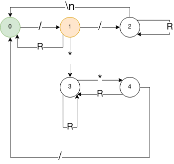

**Author:** _Stanislav Král A20N0091P_

# 3rd homework from KIV/FJP subject - Implementace jednoduchého lexikálního analyzátoru
## Solution description
- in order to remove C-like comments from a given file, I have designed a DFSA, where some transitions between states are colored based on whether the current character that is being processed should be printed out:

    - a green colored route means, that the current character should be printed to the standard output
    - an orange colored route means, that the current character is to be added to a buffer, that will be printed to the standard output only if the transition from the next state has a green colored background
    - a purple colored route means, that the current character should be printed out only if any other character on the current line has been printed out
        - this could have also been implemented by adding more states and routes, but for the sake of simplicity of this DFSA I have decided to implement it in the program that will use this DFSA
- a simple program program (`comments.py`) that implements the designed DFSA was written in the Python language
## Usage
- `python3 comments.py <file path>`, where the `<file path>` argument contains the path to the file, which should be transformed
    - if the provided path does not lead to any readable file, an error is printed out
    - if no file path is provided, an error is printed out
    - the result of the transformation is printed to the standard output
- it is recommended to forward the output of the program to another file
    - `python3 comments.py lex.yy.c > lex.yy.cless.c`
        - `lec.yy.cless.c` now contains contents of `lex.yy.c` without C-like comments
## Example
- `test_cless.c` contains contents of `test.c` but without C-like comments
